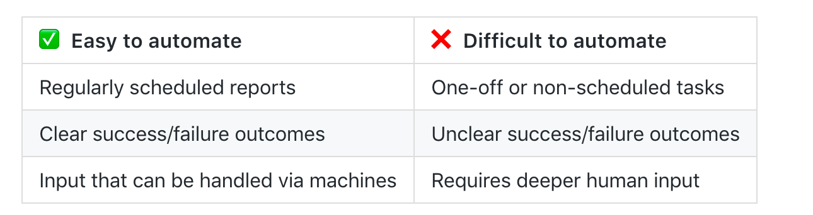

# Pipelines

Automation helps us speed those manual boring tasks. The ability to automate means you can spend time working on other more thought-intensive projects.

Automation adds monitoring and logging tasks:

## Steps to automation

Whenever you consider automating a task ask the following questions:
- When should this task begin?
- Does this task have a time limit?
- What are the inputs for this task?
- What is success or failure within this task? (How can we clearly identify the outcomes?)
- If the task fails what should happen?
- What does the task provide or produce? In what way? To whom?
- What (if anything) should happen after the task concludes?

  <h4> Top tip </h4>
  If your project is too large or loosely defined, try breaking it up into smaller tasks and automate a few of those tasks. Perhaps your task involves a report which downloads two datasets, runs cleanup and analysis, and then sends the results to different groups depending on the outcome. 
  You can break this task into subtasks, automating each step. If any of these subtasks fail, stop the chain and alert the whoever is responsible for maintaining the script so it can be investigated further.

## What is a data pipeline?

Roughly this is how all pipelines look like:

they consist mainly of three distinct parts: data engineering processes, data preparation, and analytics. The upstream steps and quality of data determine in great measure the performance and quality of the subsequent steps.

## Why do pipelines matter?

- Analytics and batch processing is mission-critical as they power all data-intensive applications
- The complexity of the data sources and demands increase every day
- A lot of time is invested in writing, monitoring jobs, and troubleshooting issues.

This makes data engineering one of the most critical foundations of the whole analytics cycle.

### Good data pipelines are:

- Reproducible: same code, same data, same environment -> same outcome
- Easy to productise: need minimal modifications from R&D to production
- Atomic: broken into smaller well-defined tasks

When working with data pipelines always remember these two statements:

---

As your data engineering and data quality demands increase so does the complexity of the processes. So more often than not you will eventually need a workflow manager to help you with the orchestration of such processes.

Think of a workflow manager as:

GNU Make + Unix pipes + Steroids

---

## Creating a simple data analysis pipeline

You will notice that you have a `census_data` directory. This contains both the scripts and the notebooks versions of the analysis.

Let's have a look at the notebooks!

### Create your own pipeline

Note that there is not a single correct answer for this. Many will have different approaches. 

🚦 Create a local script/pipeline that will run:

get data  -> clean data -> analyse data -> generate report

